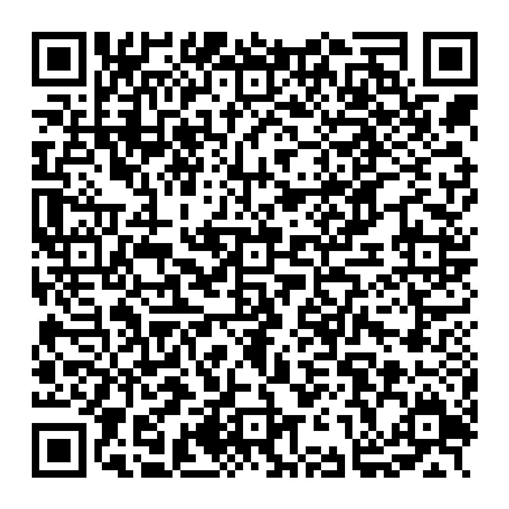

# Cyberpunks Devices Setup

AI-readable setup guides for smart devices — a manual for the age of AI assistants.

**Scan and send the link to your AI assistant** (ChatGPT, Claude, Gemini, ...) — it becomes your personal [Altruist](altruist/) setup guide.

## The idea

Instead of a paper manual, a device ships with a **QR code**. The user scans it
and sends the link to their AI assistant of choice (ChatGPT, Claude, Gemini,
any LLM). The link points to a prompt file in this repository that turns the
assistant into a personal onboarding guide for that device: it walks the user
through connection step by step, troubleshoots, and later answers questions
about how the device works.

## Devices

| Device | Guide | Description |
|---|---|---|
| [Altruist](altruist/) | [altruist-ai-assistant-guide.md](altruist/altruist-ai-assistant-guide.md) | Open-source air quality station by Robonomics |

## How to use (for humans)

Scan the QR code on your device, or open the raw link to the guide file, and
send it to your AI assistant with a message like:

> Help me set up this device.

## How it works (for AI assistants)

Each guide is a self-contained Markdown prompt: role instructions, verified
device facts, step-by-step setup flow, troubleshooting table, official links,
and a machine-readable JSON metadata block. Guides instruct the assistant to
reply in the user's language and to never invent facts beyond the file.

## License

Open knowledge for the community. See individual device docs for upstream
sources (Robonomics wiki, Home Assistant docs, etc.).
