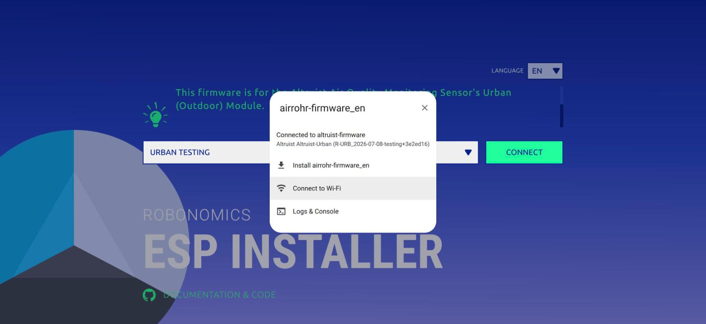
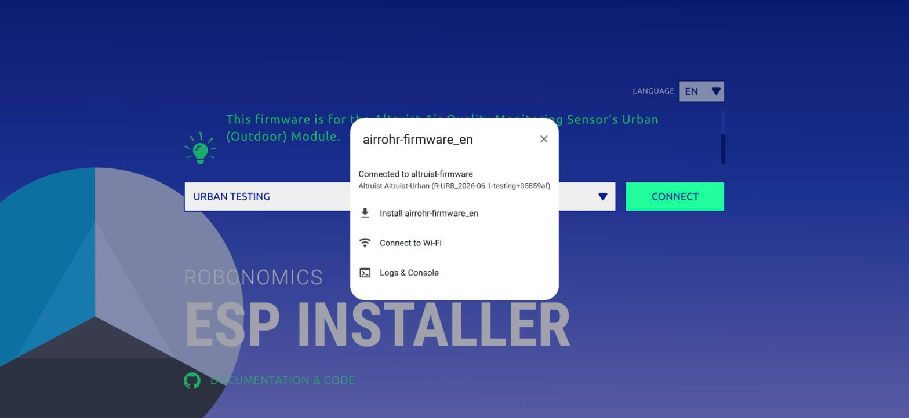
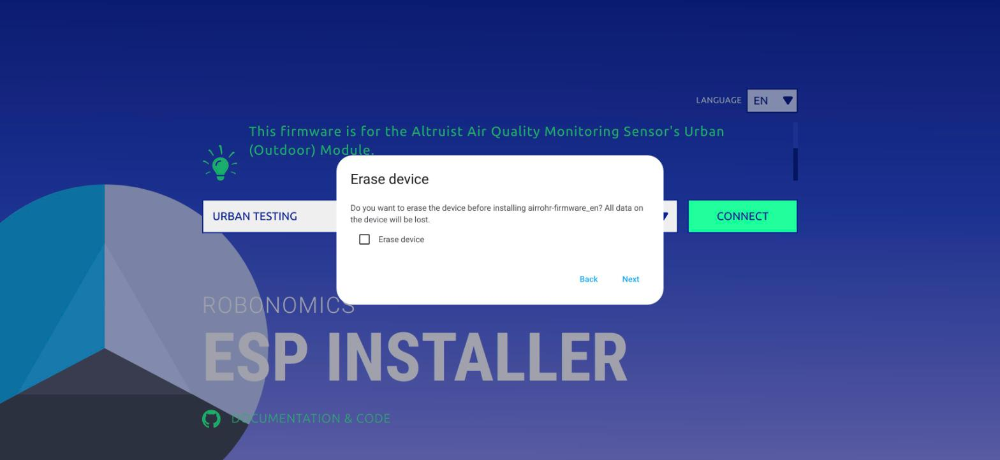
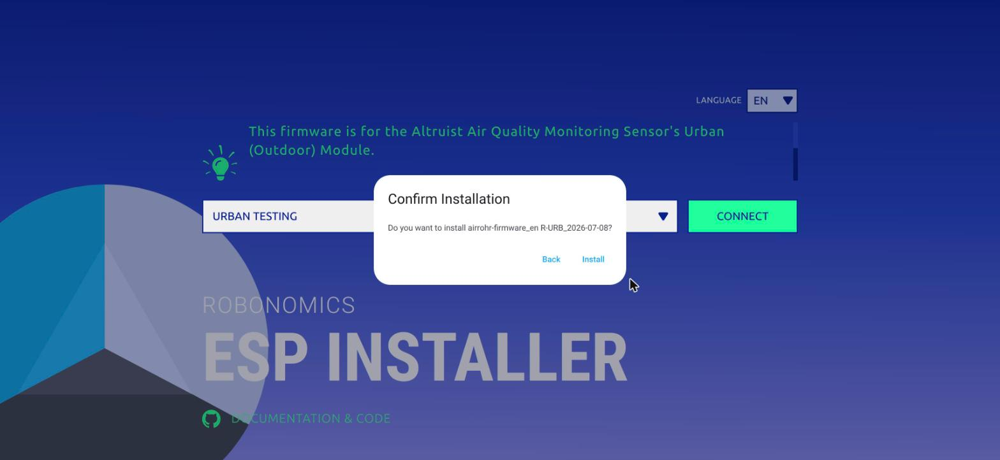
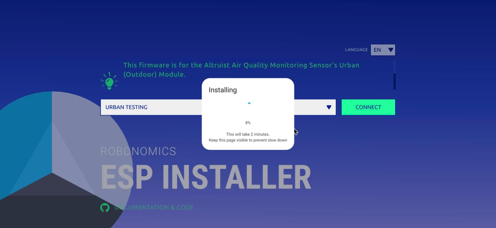
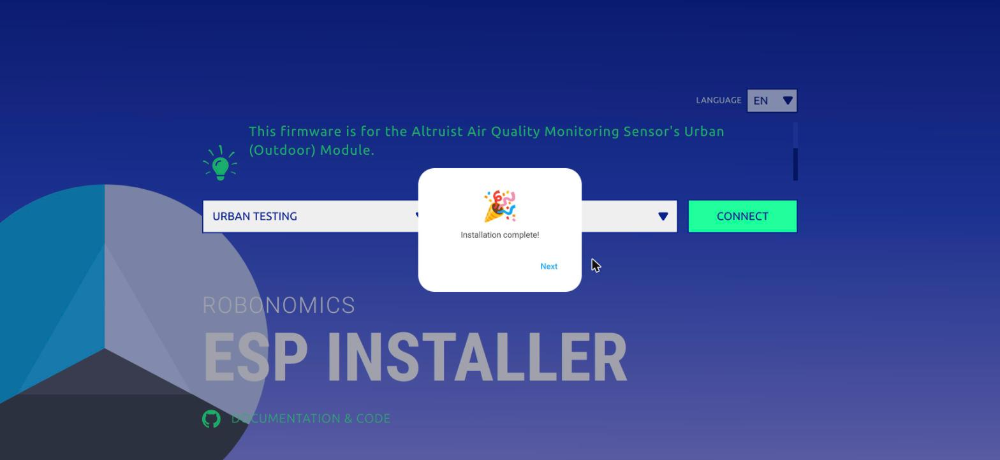
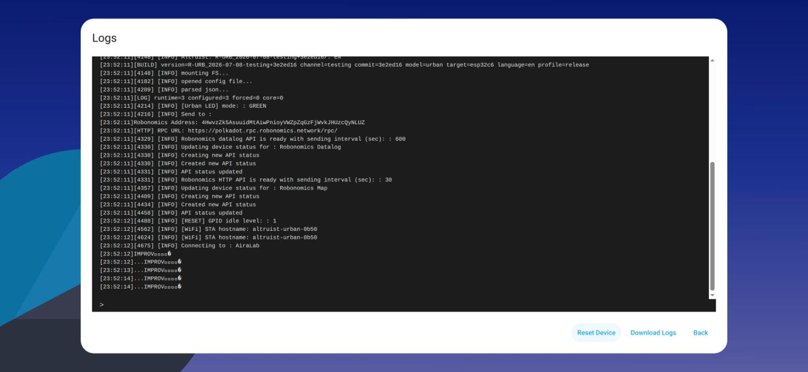
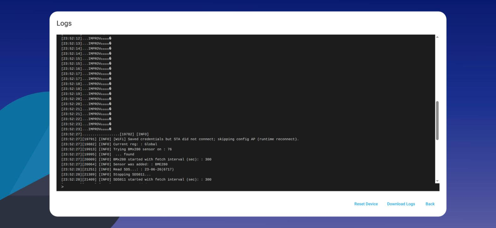

Altruist updates itself. On the Stable channel a device pulls firmware over the
air and you never touch a cable. So this post is not about updating — it is
about the other case: **you want the Testing build**, the one that carries
changes that have not finished long-term validation yet, because you want to
try them and report what breaks.

The whole thing took us under a minute of actual flashing, and about ten
minutes of fighting Linux. Both parts are below.

## Before you start

- **A desktop computer with Chrome or Edge.** The installer talks to the device
  through the Web Serial API. Every other browser is refused by the page itself,
  and no phone browser can do it. This is the single most common reason people
  give up.
- **A USB-C data cable.** A charge-only cable enumerates nothing.
- **Which module and which chip.** Urban exists on ESP32-C6 (current) and
  ESP32-C3 (legacy); Insight is C6 only. The installer asks, and the answer
  changes which binary you get.

## Step 1 — pick the firmware

Open [webflasher.robonomics.network](https://webflasher.robonomics.network/).
The EN/RU switch at the top is not only interface language: it also selects
which build you are offered, English or Russian.

Then choose the firmware — `Urban Testing` in our case — and the chip,
`ESP32-C6`. The Connect button turns green when both are set. The page also
lists Energy Monitor and Hikikomory; those are other Robonomics devices, not
Altruist.



## Step 2 — connect, and read what is already there

Click **Connect** and pick the device's serial port in the browser dialog. The
installer immediately reports what is running right now:

```
Connected to altruist-firmware
Altruist Altruist-Urban (R-URB_2026-06.1-testing+35859af)
```



That string is worth reading before you do anything else. `R-URB` is Urban,
`2026-06.1` is the base version, `testing+35859af` means it is a Testing build
from commit `35859af`. Our device was already on Testing, just an older one.

## Step 3 — the checkbox that matters

Choose **Install**, and the installer asks whether to erase the device first.



**Leave "Erase device" unchecked.** Erasing does exactly what it says: it wipes
all data on the device, and that includes the config file holding the
**Robonomics identity** — the key pair that makes this sensor *this* sensor on
the map. Erase it and the device comes back as a stranger, with its measurement
history on sensors.social orphaned. Tick that box only if you actually intend a
factory reset.

The next dialog names the build you are about to install. Ours said
`airrohr-firmware_en R-URB_2026-07-08`, which is what we wanted.



## Step 4 — wait less than it promises



The dialog says "This will take 2 minutes. Keep this page visible to prevent
slow down." Ours finished in about fifteen seconds. The "keep this page
visible" part is real, though — a backgrounded tab gets throttled by the
browser, and the transfer slows down with it.



## Step 5 — verify, don't assume

Reconnecting shows the new build:

```
Altruist Altruist-Urban (R-URB_2026-07-08-testing+3e2ed16)
```

Better still, open **Logs & Console** and hit **Reset Device** — that is a
reboot, not a reset of your settings — and watch the device come up:

```
[BUILD] version=R-URB_2026-07-08-testing+3e2ed16 channel=testing commit=3e2ed16
        model=urban target=esp32c6 language=en profile=release
[INFO] mounting FS...
[INFO] opened config file...
[INFO] parsed json...
[INFO] [Urban LED] mode: : GREEN
Robonomics Address: 4Hwv…NLUZ
[INFO] Robonomics datalog API is ready with sending interval (sec): : 600
[INFO] Robonomics HTTP API is ready with sending interval (sec): : 30
[INFO] [WiFi] STA hostname: altruist-urban-0b50
```



This answers the question everyone asks before flashing: **without "Erase
device", nothing of yours is lost.** The config is mounted and parsed, the
Robonomics address is the same one, the saved Wi-Fi credentials are still
there, and the two publishing intervals are unchanged — a reading every 30
seconds to the map, a signed datalog every 10 minutes.

Two details in that log are new in Testing and worth knowing:

- The device now has a **unique host name**, `altruist-urban-<id>` (here
  `altruist-urban-0b50`), instead of a shared `altruist.local`. If you had
  bookmarked `altruist.local`, use the IP or the new name.
- Sensors come up after Wi-Fi, each with its own fetch interval — BME280 and
  SDS011 both at 300 seconds in our unit.



There is one more line in that screenshot that surprised us:

```
[WiFi] Saved credentials but STA did not connect; skipping config AP (runtime reconnect).
```

So a device that already knows a network **will not raise its setup portal**
even when it fails to join it — it keeps retrying quietly in the background.
If you are waiting for an `Altruist-xxxxxxxxx` network to appear so you can
reconfigure it, you will wait forever. Do a Wi-Fi reset instead: on Urban,
hold the reset button for more than 10 seconds while it is running; on Insight,
`SET` + `DOWN` for 4 seconds. That clears the credentials without touching the
device identity.

## The Linux part

On Linux the port will show up in the browser and then refuse to open:

```
Failed to execute 'open' on 'SerialPort': Failed to open serial port.
```

Two causes, and it is usually both at once.

**1. You do not have permission on the port.** The device appears as
`/dev/ttyACM0`, owned by `root:dialout` with mode `crw-rw----`. If your account
is not in `dialout`, Chrome cannot open it:

```bash
sudo usermod -aG dialout $USER     # then log out and back in
```

Need it working right now, without logging out:

```bash
sudo chmod a+rw /dev/ttyACM0       # resets when you replug the cable
```

**2. ModemManager grabbed the port.** On Ubuntu and most desktop distributions
ModemManager probes every new `ttyACM` device to see whether it is a modem, and
holds it for the first seconds after plug-in — exactly when you are clicking
Connect:

```bash
sudo systemctl stop ModemManager
```

To fix it permanently, tell ModemManager to ignore Espressif devices (vendor id
`303a`, which is the native USB of the ESP32-C6):

```bash
printf 'SUBSYSTEM=="tty", ATTRS{idVendor}=="303a", ENV{ID_MM_DEVICE_IGNORE}="1"\n' \
  | sudo tee /etc/udev/rules.d/99-esp-no-modemmanager.rules
sudo udevadm control --reload
```

## Going back to Stable

OTA is pinned to Stable artifacts, and automatic updates are disabled in
Testing builds on purpose — so a Testing device will **not** quietly return to
Stable on its own. Coming back is a deliberate act: flash `Urban Stable` /
`Insight Stable` in the same installer, or trigger the manual `/ota` update,
which is the documented rollback path.

That is the whole trade. Testing gives you the new things early; in exchange you
keep an eye on the device, and you tell us what broke.
